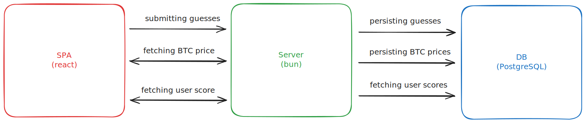

# Bitcoin Guesser

A simple application for guessing if the BTC price goes higher or lower in the next minute.

[Deployed Version (https://d1ow4n8ylz5pxh.cloudfront.net/index.html)](https://d1ow4n8ylz5pxh.cloudfront.net/index.html)

## Project Structure

* server contains the code for the server responsible for fetching the BTC price, storing the guesses of users and calculating the scores
* frontend contains the code for the Single Page Application for the player to interact with 
* infra contains the infrastructure-as-code managed by pulumi for the production deployment
* .docker contains the dockerfiles for the server and the frontend server (only used locally)

## Local development (server, frontend, infra)

First, you have to set some environment variables. My preferred way is to use [direnv](https://direnv.net/). Just copy the contents of below into a .envrc in the project.
```sh
export DB_USERNAME="bitcoin-guesser"
export DB_PASSWORD="bitcoin-guesser-password"
export DB_DATABASE="bitcoin-guesser"
export DB_HOST="localhost"
export DB_PORT="5432"
export VITE_BITCOIN_GUESSER_BASE="http://localhost:4099"
```

### Running it
If you want to just run the application you don't have to install any dependencies besides docker (and docker compose) 
```sh
docker compose up
```

### Installing dependencies locally to get Syntax, Type & Import Support

Each subdirectory has its own package.json and dependencies. I use bun as a package manager and runtime (tested version 1.2.20). Type `bun install` in the directories to install the dependencies

### Linting, Formatting, Typescript

I use typescript, eslint & prettier in the project. Lint commands are available in the respective package.json. A shared prettier & typescript config is used.

### Migrations (server)

If you want to change db schema changes locally, you have to have bun installed locally. 

```sh
cd server
bun run migration:generate # generates a new migration based on the changes you did in server/src/db/schema 

bun run migration:run # runs the migration and applies them to the running PostgreSQL db
```

### Infrastructure (infra)

To manage the AWS infrastrucure [pulumi](https://www.pulumi.com/) is used. Currently this is not run in CI, so just locally. If you want to setup the infrastructure yourself, follow the installation guide [here](https://www.pulumi.com/docs/iac/download-install/)

```sh
pulumi up # creates the complete infra stack
```

For your deployment you have to do some adjustments:
1. Change the aws:profile in the server/Pulumi.infra.yaml
2. Delete the `bitcoin-guesser-infra:dbPassword` block and create a new secret via `pulumi config set --secret bitcoin-guesser-infra:dbPassword "<password>"`
3. After you ran the pipeline, you have to adjust the dockerfile (also in server/Pulumi.infra.yaml) and the path to the cloudfront URL in the env vars in the FE build (replace the value of `VITE_BITCOIN_GUESSER_BASE`). Since the value is interpolated during build, you cannot do this upfront

## Architecture



Reasoning for the architecture:
* portable between different cloud providers
* local development is close to production environment (e.g. PostgreSQL can be used easily during local development)
* relational DB for structured data (can be extended with additional attributes & entities in the future), type safety in the code (via drizzle ORM)
* SPA due to simplicity to setup and host (no SSR needed) and no needs for SEO or small bundle sizes
* bun server container due to personal experience (but should be translatable to e.g. Lambda functions relatively easy)
* Stateless scores: The db does not save the scores a player achieved directly but rather calculates the scores based on the historic BTC prices. The main advantage is that by this we cannot get into an inconsistent state where a point is granted although the player did a wrong guess. An possible extension where this design would be beneficial could be saving a guessed price and calculating different scores based on how close the guess is. Also if the "rating" of the guesses should be changed, e.g. don't subtract a point for a wrong guess but just give 0 can be implemented for all historic data. The alternative, more conventional approach would be to create a user entity with a score attribute. 


## Current Limtations/ Areas of Improvment

* Integrate an OpenAPI schema as contract between server and SPA. Possible solutions could be [trpc](https://trpc.io/), [Zod Open API](https://hono.dev/examples/zod-openapi) or writing the schema manually and generating the interfaces with [openapi-typescript](https://github.com/openapi-ts/openapi-typescript)
* When a BTC price does not change within 1 minute, this neither grants nor substract a point. The desired outcome could differ here. This can be adjusted [here](https://github.com/patriksimms/bitcoin-guesser/blob/main/server/src/guesses/GuessesService.ts#L72)
* Currently the user is identified by a generated UUID in the client. This can be tampered with and also is not cross-device. With more time, the intefration of an identify provider like [clerk](https://clerk.com/) or [Cognito](https://aws.amazon.com/de/cognito/) could be used.
* Allow horizontal scaling: There are couple of things preventing this application for being able to be scaled horizontally, mainly missing transactions for SQL queries and the setInverval for updating the BTC price in the DB.
* If a user submits a bet and refreshes the page, there is no indication when the user is able to guess again. Some ideas are persisted [here](https://github.com/patriksimms/bitcoin-guesser/blob/main/frontend/src/App.tsx#L83)
* A fallback API for the BTC price could be used
* There could be different interpretations of the time sync when a user submits a guess and the BTC price is used for calculating if the guess was correct. Currently the time is updated once every 60 sec. The user is allowed to place a bet every 60 seconds. These two time windows (begin wait-for-btc-price-update to end), (begin user-submitted-bet to user-is-allowed-again) is not synced and therefore can be off. E.g. the user can place a guess and the setInverval updates the BTC price 10 seconds later. In theory every time a player submits a guess, exactly 60 seconds later the price has to be updated/ used for calculation for the score. In this case API requests would scale with user bets, which does not seem practical. So an algorithm has to be implemented that reduces to maximum time off between the time windows fo guesses and btc price updates
* SSE or Websockets could be used for updating the BTC prices more immediately
* The SPA is only available on the /index.html path. A redirect/ path rewrite could be implemented
* [Sentry](https://sentry.io/welcome/?utm_source=google&utm_medium=cpc&utm_id={20398270056}&utm_campaign=Google_Search_Brand_SentryKW_EMEA-Tier1_Alpha&utm_content=g&utm_term=sentry&gad_source=1&gad_campaignid=20398270056) integration for error tracing, [posthog](https://posthog.com/about) for tool analytics, AWS cost monitoring

## Testing

Due to time constraints (which I set to myself), no extensive automated testing has been implemented. There are no methods worth testing with Unit tests since most of them just interact with with external dependencies (browser APIs, server APIs, external packages). Also TTD was not used since the task was explorative at first and no need & time for using this learnings and start from scratch with TTD.

Reasonable testing would include Integration, E2E and Infrastructure tests. With more time, I would setup the following testcases. From a tools perspective I would use [Playwright](https://playwright.dev/) and [Testcontainers](https://testcontainers.com/) in combination with [vitest](https://vitest.dev/) (testcontainers only works with node.js, not bun). The tests should be integrated into the [CI pipeline](https://www.docker.com/blog/running-testcontainers-tests-using-github-actions/).

* the correct HTTP request is submitted when a user clicks on on the button on the FE
* he score is correcly updated in the FE after a guess and 60sec of waiting
* the client shows correct error messages when unexpected HTTP response and server is not reachable
* the server should capture an error when the BTC API is not reachable or returns an unexpected error
* the API of the server should throw an 429 error when a user (identified by UID) tries to submit more guesses in the minute after submitting 
* The scores should be calculated correctly (1 point for correct guess, -1 point for incorrect guess, 0 for same price). DB seeds/ static inserts into the DB should be used here. Also the setInterval for updating the BTC price should be disabled by e.g. an env var
